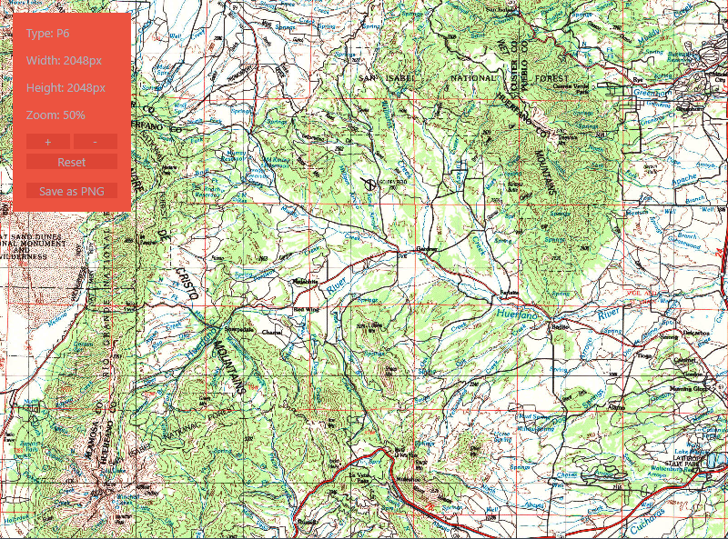
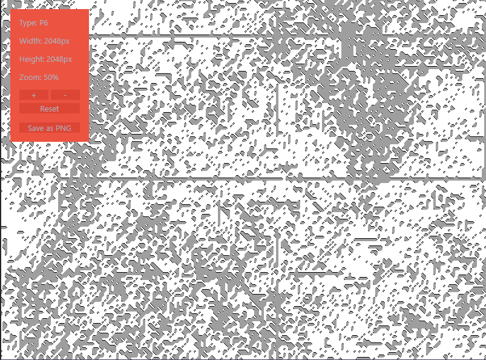
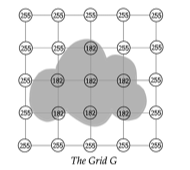
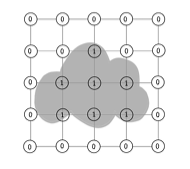
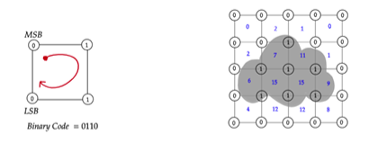
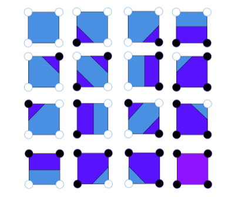
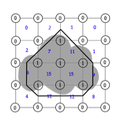

# Marching Squares

## Description

This `C` projects presents a parallelized implementation of the **[Marching Squares](https://www.baeldung.com/cs/marching-squares)** algorithm, applied specifically to topographic maps, using **Pthreads in C**. This method efficiently divides the workload among multiple threads to generate topographic map contours from an input image.

  
  

## Algorithm Steps

### Initialization and Rescaling

Initially, the input image is optionally rescaled to a predefined dimension (`2048x2048` pixels in this case) for uniformity and to facilitate a more manageable processing scale. This is **particularly useful for large images** and ensures that the algorithm performs optimally across different image sizes.

  

### Grid Sampling

The image is divided into a grid of squares. Each grid point's value is determined based on a **sigma** (`σ`) **threshold**, which helps in identifying areas of interest by comparing the average color intensity of pixels within a grid cell against `σ`. This step effectively converts the image into a binary grid representation where each edge is marked as `0` or `1`.

  
  

### Contour Mapping

The algorithm uses a predefined contour map list, which is a collection of small images corresponding to the `16 possible binary codes` generated by moving ***circularly in a clockwise direction from the top-left corner of a square grid cell***. These binary codes reflect the state of the 4 edges of a square, with each edge being part of a contour (`1`) or not (`0`). The circular motion ensures consistent binary code reading for all cells, contributing to the correct assembly of the entire contour map.

  
  

### Marching Cells

For each cell in the binary grid, the algorithm examines the corners to identify one of the `16 possible patterns`. Each pattern corresponds to a specific contour configuration. By applying this process across the grid, the algorithm delineates contours within the image.

  

## Workload Distribution

- **Rescaling:** each thread works on a different part of the image, using *bicubic interpolation* to maintain the same quality like the original image.
- **Sampling Grid:** each thread computes the binary value for the corners of its assigned squares, based on a **sigma threshold**; parallel processing of this step means multiple grid squares are evaluated simultaneously.
- **Contour Mapping:** lookup table with **16** possible patterns is used, corresponding to the **16** possible states of a **2x2** cell in the grid; threads compute the contour map and retrieve the corresponding contour image, which is then drawn onto the output image.
- **Marching Squares:** once threads have the appropriate contour segment images, they 'march' through the grid, cell by cell, in a linear fashion to draw continuous contour lines.
